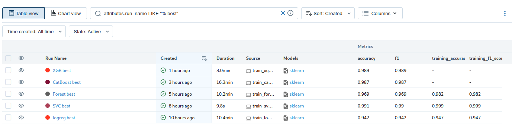
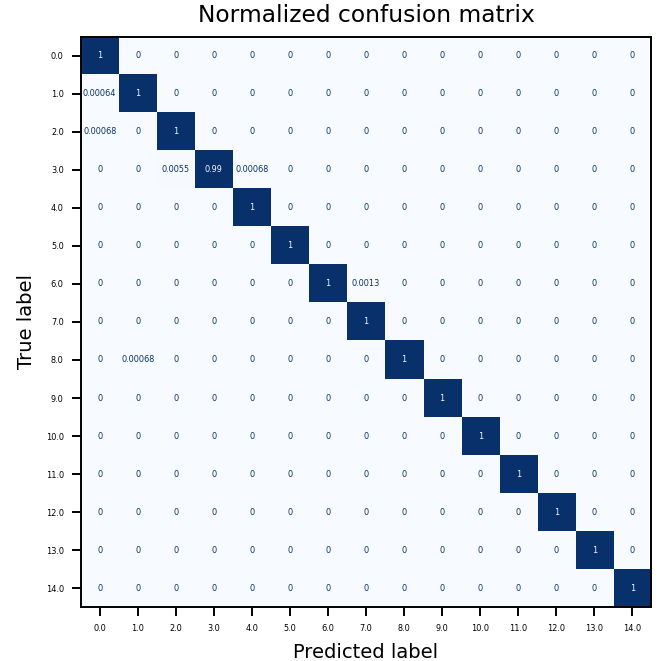
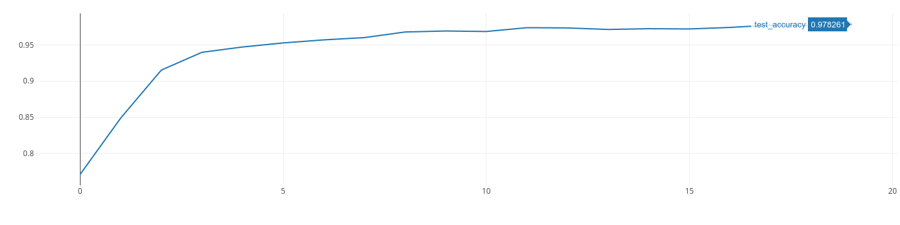

# MyFirstDatascienceProject

## Описание
Приложение для управления клавиатурой и мышью с помощью жестов.

## Установка
1. Склонировать репозиторий
    ```shell
    git clone https://github.com/Samoed/MyFirstDatascienceProject
    ```
2. Установить зависимости
    ```shell
    pip install -r requirements.txt
    ```
3. Запуск приложения
    ```shell
    python ui_app.py
    ```
   Если при запуске приложения не появилось окно с камерой, то нужно запустить `ui_app.py` с флагом `-d` или `--device` для смены камеры:
    ```shell
    python ui_app.py -d 1
    ```

## Принцип работы
Видеопоток из камеры получается с помощью `opencv` и передаются в `MediaPipe`, откуда передаются точки руки. Затем эти точки передаются в модель, которая предсказывает жест. После этого, в зависимости от жеста, происходит определенное действие (движение мышью или нажатие клавиш мыши или клавиатуры).

## Эксперименты
### Данные
Данные были взяты с сайта [Kaggle](https://www.kaggle.com/datasets/gti-upm/leapgestrecog). Из этого датасета я взял 11 классов положения руки. Так же еще для 4-х жестов я записал видео для обучения. Всего было собрано более 15 000 фотографий. Примерно по 1000 для каждого класса.

Фото жестов были обработаны с помощью `Mediapipe` и сохранены в виде `numpy` массивов.
### Выбор моделей
Были проведены эксперименты с различными моделями. Для оценки качества моделей была использована метрика `accuracy`, так как классы получились сбалансированными, но дополнительно считалось `f1`. В качестве моделей использовались:
* [Логистическая регрессия](experiments/sklearn_logreg)
* [Метод опорных векторов](experiments/sklearn_svc)
* [Случайный лес](experiments/sklearn_forest)
* Градиентный бустинг ([XGBoost](experiments/xgboost_model), [sklearn](experiments/sklearn_gradient), [CatBoost](experiments/catboost_model))
* Нейронная сеть ([PyTorch](experiments/train_pytorch))

Код обучения моделей в папке [`experiments`](experiments). Для сохранения результатов экспериментов был использован `mlflow`.

Для каждой модели были подобраны оптимальные гиперпараметры. Для этого использовалась библиотека `optuna`.

### Результаты
В результате обучения было решено выбрать SVM, так как эта модель показала наилучшее качество.

| Модель                  | accuracy | f1    |
|-------------------------|----------|-------|
| Логистическая регрессия | 0.942    | 0.942 |
| Метод опорных векторов  | 0.991    | 0.99  |
| Случайный лес           | 0.969    | 0.969 |
| XGBoost                 | 0.989    | 0.989 |
| CatBoost                | 0.987    | 0.987 |
| Нейронная сеть          | 0.978    | 0.978 |



Матрица ошибок для SVM:


Accuracy на тестовой выборки для нейронной модели:


## Демо работы
1. [Набор жестов](https://youtu.be/abdMVR_DWkw)
2. [Работа с Miro](https://youtu.be/w5kQKZJLQdM)
